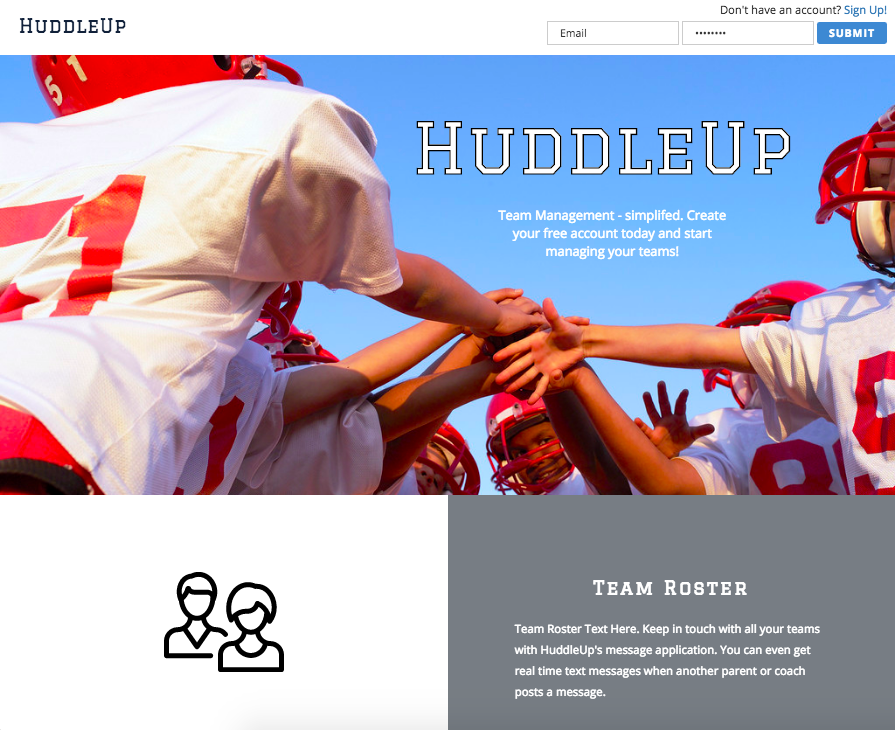
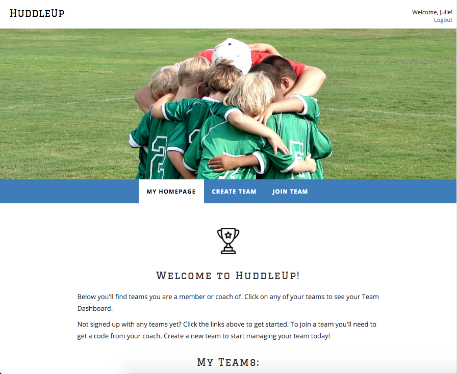
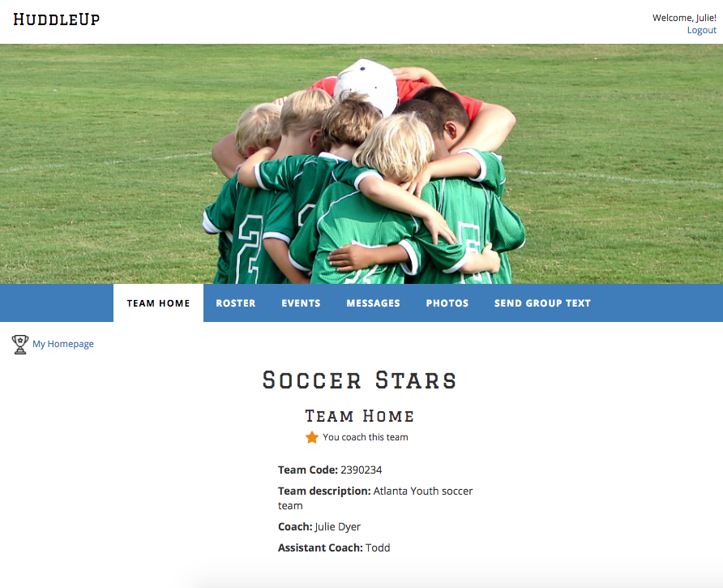
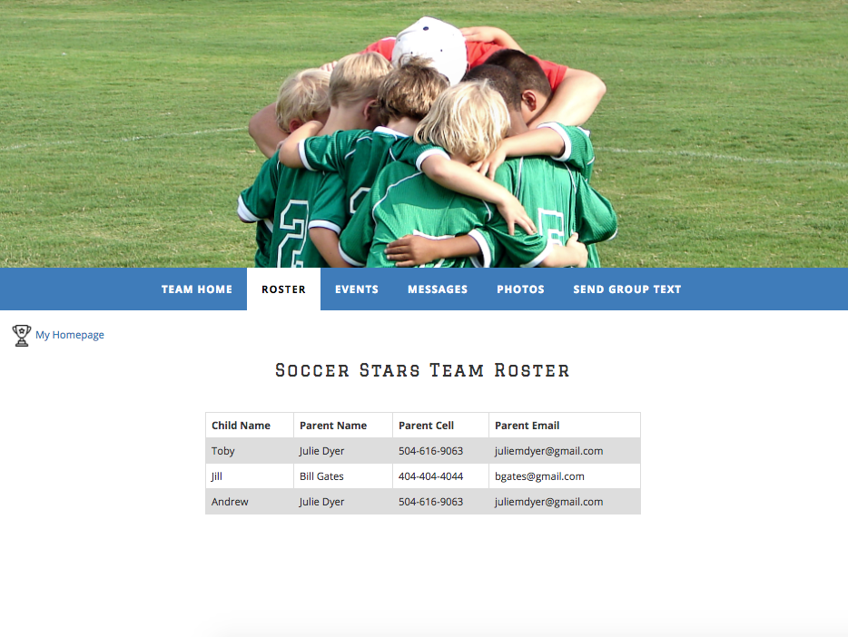
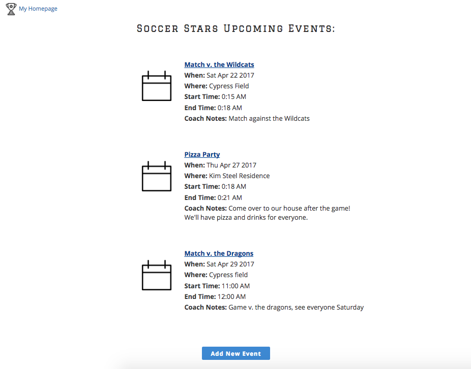
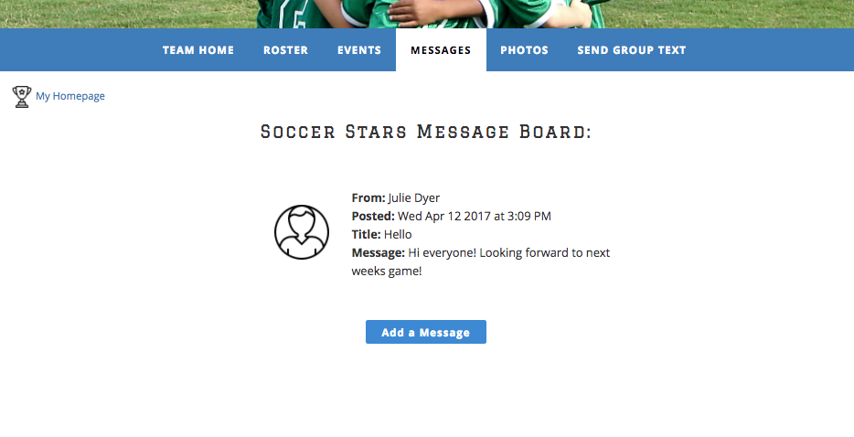
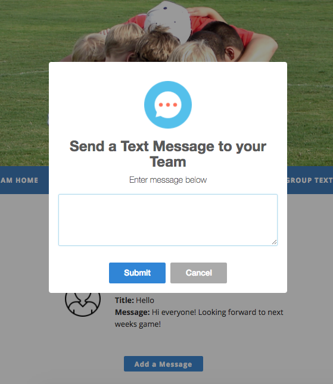

# HuddleUp
---
## [Live Demo](http://www.letshuddleup.net)

## What It Is
HuddleUp is a site used to manage little league sports teams. It allows coaches to create and manage teams and communicate events and information to parents. Parents can log in with a unique code from the coach and view the upcoming team schedule, post messages and photos and view the team roster.

## Team members
* <a href="https://github.com/toddbri">Todd Briley</a>
* <a href="https://github.com/juliemdyer">Julie Dyer</a>
* <a href="https://github.com/jwmarion">James Marion</a>
* <a href="https://github.com/jonshaw2">Jonathan Shaw</a>

## Languages and Technologies used
* Node.js
* Express
* PostgreSQL
* JavaScript
* jQuery
* HTML
* CSS
* Amazon Web Services (AWS)


## Dependencies and Plugins
* express
* express-session
* multer
* bluebird
* pg-promise
* body-parser
* twilio
* bcrypt
* timepicker jQuery Plugin
* SweetAlert2 jQuery Plugin
* dropzone JavaScript Plugin


## Team Strategy
A week before our project start date we got together to brainstorm ideas and finalize our project choice. We choose a project that was within the scope of time frame and required technologies. We initially created user stories to map out the functionality of the site. We used these stories to build the structure of the site and all it's pages.
<br>
We started coding using mob programming to build our database and our core functionality. Once we had that working, we then separated out to complete stretch goals.

## Site Walkthrough

### Landing Page
Users can sign in if they already have an account, or create an account. Page also shows the sites main features with descriptions.
The sign up button takes a new user to a login form where they can submit their info. The info is sent to the backend via ajax. Passwords are encrypted and stored in our database securely using bcrypt.
<p align='center'>
    </img>
</p>


### User Home
This page allows you to join or create a team, and view links to teams you are already a member or a coach of.
The backend queries the database to pull the current teams that the user is either a coach of or a parent of. If the user is a coach a star appears next to the team name indicating they coach that team and have special coach permissions (like adding events and sending team text messages).
<br>
The create team button opens a SweetAlert2 pop up with a form to fill out with team details. After submission the user is taken to the newly created team page and is given a code that can be sent out to parents so they can join the team.
<br>
The join team button also opens a form where the parent can submit the team code and the child's name.

<p align='center'>
    </img>
</p>

### Team Home
After clicking an existing team or creating a team the user is brought to that Team's homepage. Coach's can see the team code that parents use to join the team. Each team has its own landing page.
Our backend uses express to query the database for the current team's information and displays the info via handlebars.
<p align='center'>
    </img>
</p>

### Roster
This page allows coaches and parents to see the team roster and parent contact information.
Our backend uses express to query the database for the current team's members and displays the info via handlebars in a table format.
<p align='center'>
    </img>
</p>

### Events
This page allows parents and coaches to view the teams upcoming events. Only coaches are allowed to add new events. If the current logged in user is the coach of that team they will see a button for "Add New Event".
When a coach clicks "Add New Event" a SweetAlert2 pop up appears with a form to enter details about the event. On submit the event details are sent to the backend via ajax and added to the database. The server send back a success message information the user that the message post was successful and the new event is appended to the events page.
<p align='center'>
    </img>
</p>


### Messages
Here parents and coaches can send messages to the team.
When the user clicks the add message button a SweetAlert2 pop up appears. On submit the message is sent via ajax to our node.js backend and added to the database. The server sends back a success message informing the user that the message post was successful and the new message is appended to the message board.
<p align='center'>
    </img>
</p>


### Photos
Here parents and coaches can upload and share their own photos from past events.
The photo interface uses dropzone which allows the user to drag and drop an image. This photo is then uploaded and displayed being sent to our server and database through multer.
<p align='center'>
    </img>
</p>


### Send Group Text
Only coaches of teams can see this Send Group Text navigation link. This allows coaches to send a real time text message to all parents of the team.
When clicked a SweetAlert2 pop up window appears that then uses ajax to send a message to the node.js backend which uses the twilio service to send the text.
<p align='center'>
    </img>
</p>


## Challenges

### Challenge 1 - Planning a project with a short timeline
Originally we were supposed to have 5 days for this project, but due to class schedule changes we ended up only having 3 and half days.
As a solution we re-scoped to a product that we could complete in the given time frame and set stretch goals to add additional features as time went out. We prioritized those stretch goals to get the most important features in the product in the least amount of time.
<br>

### Challenge 2 - Working with Git in Team Settings
This is the first project where we had multiple people working on the same project files at the same time. We made sure to learn the nuances of git and git merge. We worked together to fix our merge conflicts and came out with a better understanding of the version control process.

### Challenge 3 - Uploading Photos
We initially had difficulty getting the photo upload interface to work. After trying multiple options we settled on dropzone (interface for the drag and drop) and multer (middleware for handling file transfers).
The code below handles the file naming. We made sure to make every file name unique no matter what it was uploaded as.
```JavaScript
var storage = multer.diskStorage({
    destination: function (req, file, cb) {
        cb(null, 'public/photos/');
    },
    filename: function (req, file, cb) {
      let extArray = file.mimetype.split("/");
   let extension = extArray[extArray.length - 1];
   cb(null, file.fieldname + '-' + Date.now()+ '.' +extension);
  }
});
var upload = multer({ storage: storage });
```
<br>
We inserted the image data with the user and team id's stored in session data to associate the pictures with a team and user. We also sliced the filename given to us by multer so we can store the exact path in the database.
```JavaScript
app.post('/photoUpload', upload.single('file'), function(req, res, next) {
  var id = req.body.id;
  db.none(`insert into photo values (default,$1,$2,$3,$4,now())`,[
    req.session.teamId,
    req.session.userId, req.file.path.slice(7),
    req.file.originalname])
  .then(function(){
    res.send('success');
  })
  .catch(function(err){
      console.log(err.message);
  });
});
```


### Challenge 4 - Getting jQuery plugins to work on top of SweetAlert2
SweetAlert2 (swal) lets you create pop ups with custom HTML. We wanted to register event handlers on some of those HTML elements, however swal dynamically inserts those into the DOM when it creates the pop up. We had to the swal's onOpen configuration option to call a function that registered the event handlers now that those elements were in the DOM.
<br>
At this point we had access to datepicker and timepicker jquery Plugins but they were showing up behind the swal pop up. To fix that we used the z-index property of timepicker to move it above/on top of the plugin so it can actually be seen.
```JavaScript
swal({
title: 'Add a new Event',
showCancelButton: true,
html:
    '<p class="swalLabel">Title:</p>' +
    '<input type="text" id="" name=" title" id="eventTitle" class="swal2-input title">' +
    '<p class="swalLabel">Date:</p>' +
    '<input type="text" name="date" id="eventDate" class="swal2-input date">' +
    '<p class="swalLabel">Start Time:</p>' +
    '<input type="text" id="eventStartTime" class="timepicker swal2-input startTime">' +
    '<p class="swalLabel">End Time:</p>' +
    '<input type="text" id="eventEndTime" class="timepicker swal2-input endTime">' +
    '<p class="swalLabel">Location:</p>' +
    '<input type="text" id="swal-input1" name="location" id="eventText" class="swal2-input location">' +
    '<p class="swalLabel">Comment:</p>' +
    '<input type="text" id="swal-input1" name="comments" id="eventComment" class="swal2-input comments">',
onOpen: function(){
  $("#eventDate").datepicker();
  $('#eventStartTime').timepicker({
        timeFormat: 'h:mm p',
        interval: 15,
        minTime: '8:00am',
        maxTime: '10:00pm',
        defaultTime: '9:00am',
        startTime: '9:00am',
        dynamic: false,
        dropdown: true,
        scrollbar: true,
        zindex: 1100
  });
  $('#eventEndTime').timepicker({
        timeFormat: 'h:mm p',
        interval: 15,
        minTime: '10',
        maxTime: '6:00pm',
        defaultTime: '11',
        startTime: '10:00',
        dynamic: false,
        dropdown: true,
        scrollbar: true,
        zindex: 1100
  });
}
```
<br>
# huddle-up
# huddle-up
